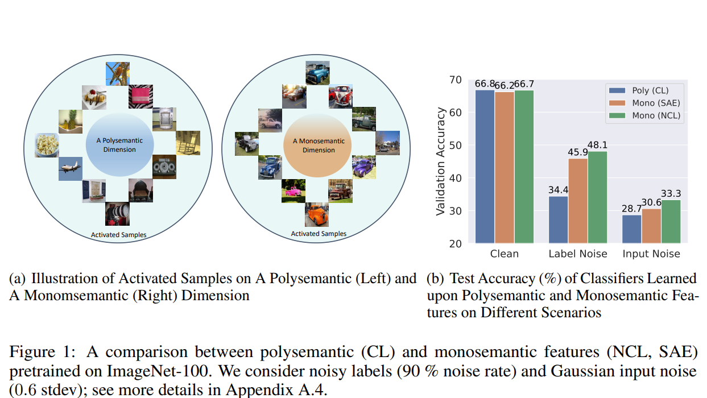

# Beyond Interpretability: The Gains of Feature Monosemanticity on Model Robustness

Official PyTorch implementation of the paper Beyond Interpretability: The Gains of Feature Monosemanticity on Model Robustness by Qi Zhang, [Yifei Wang*](https://yifeiwang77.com/), Jingyi Cui, Xiang Pan, Qi Lei, Stefanie Jegelka, [Yisen Wang](https://yisenwang.github.io/)


## TLDR

This work challenges the common “accuracy-interpretability” tradeoff by demonstrating the potential of feature monosemanticity to bring clear gains in model accuracy. These gains manifest
themselves in various aspects of “learning robustness” that we can think of: input noise, label noise, out-of-domain data, few-shot image data, and few-shot language data. The diverse set of evidence
strongly indicates that feature monosemanticity provides a general sense of robustness compared to polysemantic features,


 


## Installation

The codebase is built upon a previous version of [```solo-learn```](https://github.com/vturrisi/solo-learn) (the version on Sep 27, 2022). To avoid unexpected errors, first create a ``Python3.8`` environment, and then install the reposoity as below.
```
# clone the repository
git clone https://github.com/PKU-ML/non_neg
# create environment
conda create -n non_neg python=3.8
conda activate non_neg
# install dependences
cd non_neg
pip3 install .[dali,umap,h5] --extra-index-url https://developer.download.nvidia.com/compute/redist --extra-index-url https://download.pytorch.org/whl/cu113
```

## Obtain Polysemantic/Monosemantic Representations


To attain feature monosemanticity, we conisder a intrinsic method non-negative contrastive learning (NCL) and a post-hoc method sparse autoencoder (SAE). Pretrain with the default configuration files using the following command.

### CIFAR-100 
```bash
# SimCLR (Poly)
python3 main_pretrain.py \
    --config-path scripts/pretrain/cifar \
    --config-name simclr.yaml
# NCL (Mono)
python3 main_pretrain.py \
    --config-path scripts/pretrain/cifar \
    --config-name ncl.yaml

# SAE (Mono)
python3 main_sparse.py \
    --config-path scripts/pretrain/cifar \
    --config-name sae.yaml
```


### ImageNet-100
```bash
# SimCLR (Poly)
python3 main_pretrain.py \
    --config-path scripts/pretrain/imagenet-100 \
    --config-name simclr.yaml
# NCL (Mono)
python3 main_pretrain.py \
    --config-path scripts/pretrain/imagenet-100 \
    --config-name ncl.yaml

# SAE (Mono)
python3 main_sparse.py \
    --config-path scripts/pretrain/imagenet-100 \
    --config-name sae.yaml
```


## Noisy Linear Pobing


After that, for linear evaluation with different noises, run the following command:


```bash
# Simclr (Mono)
python3 main_linear.py \
    --config-path scripts/linear/{dataset} \
    --config-name simclr_clean.yaml (simclr_label_noise.yaml, simclr_gaussian_noise.yaml, simclr_uniform_noise.yaml) \
    pretrained_feature_extractor=path/to/pretrained/feature/extractor

# NCL (Mono)
python3 main_linear.py \
    --config-path scripts/linear/{dataset} \
    --config-name ncl_clean.yaml (ncl_label_noise.yaml, ncl_gaussian_noise.yaml, ncl_uniform_noise.yaml) \
    pretrained_feature_extractor=path/to/pretrained/feature/extractor

# SAE (Mono)
python3 main_linear.py \
    --config-path scripts/linear/{dataset} \
    --config-name sae_clean.yaml (sae_label_noise.yaml, sae_gaussian_noise.yaml, sae_uniform_noise.yaml) \
    pretrained_feature_extractor=path/to/pretrained/feature/extractor
```


Here ``dataset={cifar,imagenet100}``. We use the argument ``pretrained_feature_extractor`` to configure the path of the pretrained checkpoints. We apply different noises (label noise, uniform and gaussain input noise) in different scripts. 


## Full Noisy Finetuning

And for noisy fine-tuning evaluation, run the following command:


```bash
# Simclr (Mono)
python3 main_linear.py \
    --config-path scripts/finetuning/{dataset} \
    --config-name simclr_clean.yaml (simclr_few_shot.yaml, simclr_label_noise.yaml) \
    pretrained_feature_extractor=path/to/pretrained/feature/extractor

# NCL (Mono)
python3 main_linear.py \
    --config-path scripts/finetuning/{dataset} \
    --config-name ncl_clean.yaml (ncl_label_noise.yaml, ncl_few_shot.yaml) \
    pretrained_feature_extractor=path/to/pretrained/feature/extractor

# SAE (Mono)
python3 main_linear.py \
    --config-path scripts/finetuning/{dataset} \
    --config-name sae_clean.yaml (sae_label_noise.yaml, sae_few_shot.yaml) \
    pretrained_feature_extractor=path/to/pretrained/feature/extractor
```


## Pretrained Checkpoints

The following table provides the pre-trained checkpoints for CL and NCL.

<table><tbody>
<!-- START TABLE -->
<!-- TABLE HEADER -->
<th valign="bottom"></th>
<th valign="bottom">CIFAR-100</th>
<th valign="bottom">ImageNet-100</th>
<!-- TABLE BODY -->
<tr><td align="left">checkpoints</td>
<td align="center"><a href="https://drive.google.com/drive/folders/1EbF9oKFu9rjsfRj_hv-Q-GVYKUSVxIkP?usp=sharing">download</a></td>
<td align="center"><a href="https://drive.google.com/drive/folders/1iIqn2hklptrlG3bLmjULw_rfKKO-JC5s?usp=sharing">download</a></td>
</tr>
</tbody></table>


## Acknowledgement

Our codes borrow the implementations of SimCLR in the solo-learn repository: https://github.com/vturrisi/solo-learn
